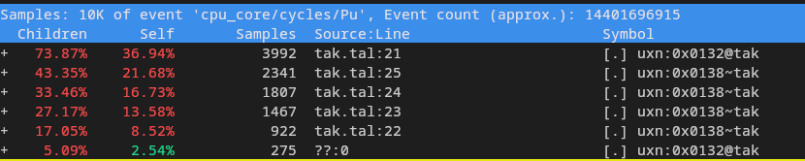
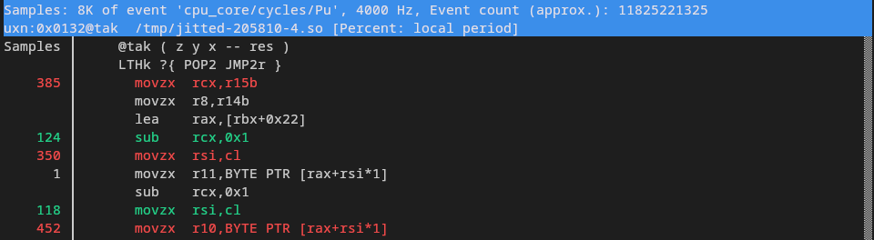
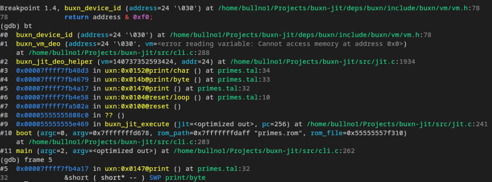

# buxn-jit

[](LICENSE)

A JIT runtime for [buxn](https://github.com/bullno1/buxn).

## Building

To build: `BUILD_TYPE=RelWithDebInfo ./build`.

To monitor, build and run tests on change: `BUILD_TYPE=RelWithDebInfo ./watch`.

## JIT API

Refer to [jit.h](include/buxn/jit.h).

`buxn_jit_execute` is a drop-in replacement for `buxn_vm_execute`.
Execution of complex vectors would be automatically faster.

There is also a hook API for other tools such as native profile or debugger.
The hooks are only activated at (JIT) compile time so performance impact should be minimal.

The [cli.c](src/cli.c) is an examplle of a terminal uxn emulator with JIT and hooks enabled.

## perf hook




[jit/perf.h](include/buxn/jit/perf.h)

This hook allows JIT'ed code to be profiled with `perf`:

```sh
# Record data
perf record -k CLOCK_MONOTONIC -g --call-graph=dwarf bin/RelWithDebInfo/buxn-jit-cli <file>.rom [args]
# Inject data with JIT dump. This step is important!
perf inject --jit --input=perf.data --output=perf.jit.data
# Show a report
perf report -Mintel -g -i perf.jit.data
```

The ROM must be compiled using [buxn-asm](https://github.com/bullno1/buxn/blob/master/doc/asm.md).
The `.rom.sym` and `.rom.dbg` files need to be in the same directory as the ROM.

## gdb hook



[jit/gdb.h](include/buxn/jit/gdb.h)

This hook allows JIT'ed code to have its location shown in gdb backtrace:

```sh
gdb --args bin/RelWithDebInfo/buxn-jit-cli <file>.rom [args]
```

```gdb
# Load the gdb reader plugin
# The path must be absolute so adjust accordingly
jit-reader-load /path/to/buxn-jit/bin/RelWithDebInfo/libbuxn-jit-gdb-reader.so
# Set a breakpoint in the native code
b buxn_vm_deo
# Run it
run
# Display backtrace
bt
```

The ROM must be compiled using [buxn-asm](https://github.com/bullno1/buxn/blob/master/doc/asm.md).
The `.rom.sym` and `.rom.dbg` files need to be in the same directory as the ROM.
